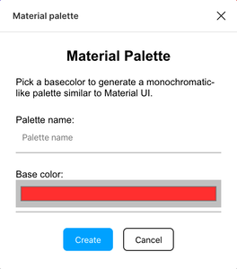
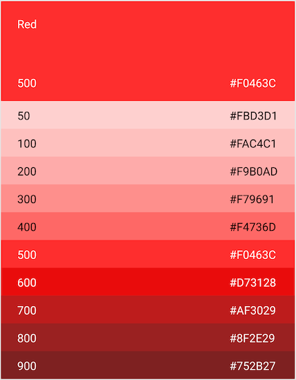

# Material palette

Create a Material-like palette quickly and easily!

This plugin groups all colors together into a Material-UI style palette.

#### UI

#### Example palette

--- 

Extended from figma plugin examples `Webpack`

To build:
* `$ npm install`
* `$ npx webpack`
