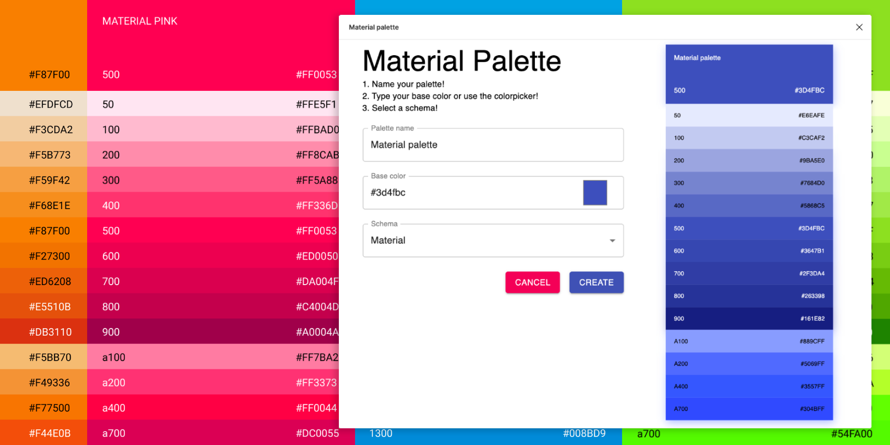

# Material palette

#### A plugin for Figma
##### Create a Material UI or Monochromatic palette in Figma quickly and easily!

* Select a name for your palette
* Pick your base color with the native color picker
* Select a Schema between Material, Monochromatic, True Monochromatic

--- 

Extended from figma plugin examples `Webpack`

To build:
* `$ npm install`
* `$ npx webpack`
